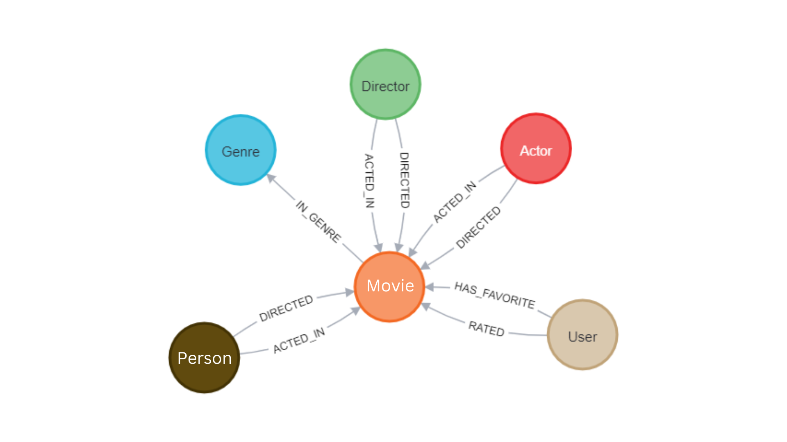

= Building Neo4j Applications with Python and Flask

> Learn how to interact with Neo4j from Python using the Neo4j Python Driver

This repository accompanies the link:https://graphacademy.neo4j.com/courses/app-python/[Building Neo4j Applications with Python course^] on link:https://graphacademy.neo4j.com/[Neo4j GraphAcademy^].

For a complete walkthrough of this repository,  link:https://graphacademy.neo4j.com/courses/app-python/[enrol now^].

= Connect with Me

I'm passionate about data science, graphs, and building applications with Python and Neo4j. If you're interested in these topics too, I'd love to connect with you on LinkedIn. Feel free to link:https://www.linkedin.com/in/youssef-bezzarga/[connect with me on linkedin] and let's exchange ideas and insights!

🌟 Enjoying this project? Show your support by starring the repository! 🌟 Your stars help others discover and benefit from this project too. 

**Click on the ⭐️ button at the top of the repository to give it a star!**

== Introduction

In this repository, we focus on developing methods inside the DAO (Data Access Object) classes to facilitate querying and transaction handling with a Neo4j database. Whether you're new to Neo4j or an experienced developer looking to enhance your skills in Python and graph databases, this project provides a hands-on opportunity to work with Neo4j's powerful graph technology.

== Overview

The project is structured around the following key components:

1. **DAO Classes**: Inside the `api/dao` directory, you'll find Python classes responsible for interacting with the Neo4j database. These classes contain methods for executing queries, transactions, and data manipulation operations using the Neo4j Python Driver.

2. **Test Files**: The `/tests` directory contains Python test files that validate the functionality of the methods implemented in the DAO classes. These tests ensure that the database interactions perform as expected and help maintain code quality.

3. **Middleware**: The `/api/middleware` directory includes middleware components used in the Flask application.

4. **Routes**: Inside the `/api/routes` directory, you'll find Python modules containing route definitions for the Flask application.

5. **Example**: This directory contains example files or scripts demonstrating how to use the DAO classes or interact with the Neo4j database.

6. **Instance**: The `/instance` directory may include configuration files or sensitive data specific to your local development environment.

7. **Neoflix**: This directory contains the Python virtual environment (`neoflix`) used for isolating dependencies for this project.

8. **Public**: Inside the `/public` directory, you may find static assets such as CSS, images, and JavaScript files used in the web application.

9. **Setup.py**: The `setup.py` file is used to install the project as a Python package and declare its dependencies.

10. **.env**: The `.env` file contains environment variables, including Neo4j credentials and configuration settings.

11. **.gitpod.yml**: The `.gitpod.yml` file contains configuration settings for Gitpod, an online IDE.

12. *requirements.txt*: The `requirements.txt` file lists all the Python dependencies required for this project. You can install these dependencies using `pip install -r requirements.txt`.

Throughout the project, we emphasize best practices for working with Neo4j databases, efficient data modeling techniques, and implementing graph algorithms. Whether you're building recommendation systems, social networks, or knowledge graphs, the skills you develop here will be invaluable.

Now, let's dive into the details of setting up your development environment and exploring the DAO classes for interacting with Neo4j.

== A Note on comments

You may spot a number of comments in this repository that look a little like this:

[source,python]
----
# tag::something[]
someCode()
# end::something[]
----

We use link:https://asciidoc-py.github.io/index.html[Asciidoc^] to author our courses.
Using these tags means that we can use a macro to include portions of code directly into the course itself.

From the point of view of the course, you can go ahead and ignore them.

== Setting up your environment

[source,sh]
----
python -m venv neoflix

source neoflix/bin/activate
----

== Connecting with your Neo4j Sandbox Credentials

Once you have enrolled to the Neo4j course (link is on top of this files), you will recieve your Neo4j sandbox credentials that you can put in the `\.env` file ( rename `.env.example` to `.env` ).

[source,env]
NEO4J_URI=bolt://{sandbox_ip}:{sandbox_boltPort}
NEO4J_USERNAME={sandbox_username}
NEO4J_PASSWORD={sandbox_password}

> ***Warning:*** 
>
> - Once your credentials were generated, they are valid for **3 days** (upgradable to 7). After that, you will need to set your new credentials.
> - When refreshing any course page or relogging in, **new credentials** will be generated for you, so you better finish the project and then do the database checks in the course with your final credentials to update your course progress.

== Installing Requirements

To install the Python dependencies required for this project, execute the following command in your terminal:

[source,shell]
----
pip install -r requirements.txt
----

== Running the Application

[source,sh]
export FLASK_APP=api
export FLASK_ENV=development
flask run

== Setting the Uniqueness Constraint

Once you have parametered your `\.env` file and successfully connected to the Neo4j sandbox, you will have to run this cypher query to define the **UserEmailUnique** constraint.

[source,cypher]
CREATE CONSTRAINT UserEmailUnique
IF NOT EXISTS
FOR (user:User)
REQUIRE user.email IS UNIQUE;

== Data Model

The data model represents the structure of entities and relationships in the Neo4j graph database.

[source,cypher]
----
CALL db.schema.visualization()
----

This query retrieves all nodes and relationships in the database.

.Data Model

*Explanation*:

The data model consists of the following elements:

=== Nodes

1- **Movie**:

      * *Properties*: 
        - `name`: Movie
        - `indexes`: year, imdbRating, released, imdbId, title, tagline
      * *constraints*: 
          - Constraint(id=75, name='constraint_3d5fcb7f', type='UNIQUENESS', schema=(:Movie {movieId}), ownedIndex=59)
          - Constraint(id=77, name='constraint_737d9c1d', type='UNIQUENESS', schema=(:Movie {tmdbId}), ownedIndex=61)
      * *Explanation*: 
        - Represents movies in the database with properties like `year`, `imdbRating`, `released`, `imdbId`, `title`, and `tagline`. Indexed properties include `year`, `imdbRating`, etc., and constraints ensure uniqueness based on `movieId` and `tmdbId`.

2- **Person**:

  * *Properties*: 
    - `name`: Person
  * *Explanation*: 
    - Represents individuals who can act as **actors** or **directors** in movies.

3-  **Genre**:

  * *Properties*: 
    - `name`: Genre
  * *Explanation*: 
    - Represents genres of movies.

=== Relationships

* **ACTED_IN**: Connects actors to movies.
  
* **DIRECTED**: Connects directors to movies.

* **IN_GENRE**: Connects movies with their genres.

* **HAS_FAVORITE**: Indicates the favorite movies of users.

* **RATED**: Represents ratings given by users to movies.

These relationships define the connections between nodes in the graph, such as actors acting in movies, directors directing movies, etc.

== How Similarity for Recommendations is Calculated

The similarity for recommendations is calculated using a collaborative filtering approach, leveraging the relationships between movies and user interactions within the movie database. One method to determine movie similarity is by identifying movies that share common attributes such as genre, actors, directors, and user preferences.

For example, in the Neo4j-based movie database application, similarity for recommendations is found using a custom Cypher query. Here's a simplified overview of the process:
[source,cypher]
MATCH (:Movie {tmdbId: $id})-[:IN_GENRE|ACTED_IN|DIRECTED]->()<-[:IN_GENRE|ACTED_IN|DIRECTED]-(m)
WHERE m.imdbRating IS NOT NULL
WITH m, count(*) AS inCommon
WITH m, inCommon, m.imdbRating * inCommon AS score
ORDER BY score DESC
SKIP $skip
LIMIT $limit
RETURN m {
 .*,
 score: score,
 favorite: m.tmdbId IN $favorites
} AS movie

This Cypher query retrieves movies similar to the specified movie ID based on shared attributes such as genre, actors, and directors. It calculates a score for each similar movie, prioritizing those with higher IMDb ratings and common attributes. Additionally, it identifies whether each movie is favorited by the user, enhancing personalized recommendations.

2. **Execution and Retrieval:**
The Cypher query is executed within the Neo4j database, and the results are fetched using the Python driver. These results are then processed and returned as similar movie recommendations to the user.

This collaborative filtering approach enables the movie database application to provide personalized and relevant recommendations based on user preferences and similarities between movies.

== Test Files

These test files are included inside the `tests` folder and serve various purposes:

- `01_connect_to_neo4j__test.py`: Tests the connection to the Neo4j database and verifies the setup of environment variables.
- `02_movie_list__test.py`: Tests listing movies with pagination and ordering functionality.
- `03_registering_a_user__test.py`: Tests user registration with email, password, and name.
- `04_handle_constraint_errors__test.py`: Tests handling of unique constraint errors during user registration.
- `05_authentication__test.py`: Tests user authentication with email and password.
- `06_rating_movies__test.py`: Tests the functionality of rating movies by users.
- `07_favorites_list__test.py`: Tests managing favorite movies for users.
- `08_favorite_flag__test.py`: Tests setting and unsetting favorite flags for movies.
- `09_genre_list__test.py`: Tests listing genres of movies.
- `10_genre_details__test.py`: Tests retrieving details of specific genres.
- `11_movie_lists__test.py`: Tests listing movies by genre, actor, or director.
- `12_movie_details__test.py`: Tests retrieving details of specific movies.
- `13_listing_ratings__test.py`: Tests listing ratings given to movies by users.
- `14_person_list__test.py`: Tests listing people (actors and directors).
- `15_person_profile__test.py`: Tests retrieving details of specific people (actors or directors).

== Conclusion

In conclusion, this README provides comprehensive documentation for the Neo4j Movie Recommendation System API. 
This covers the project overview, installation guide, usage instructions, data model explanation, relationship details, and descriptions of test files. Additionally, a summary.md file containing key notes from the courses is available for further reference.

For any inquiries, feedback, or contributions, please don't hesitate to reach out.

Thank you for your attention!

